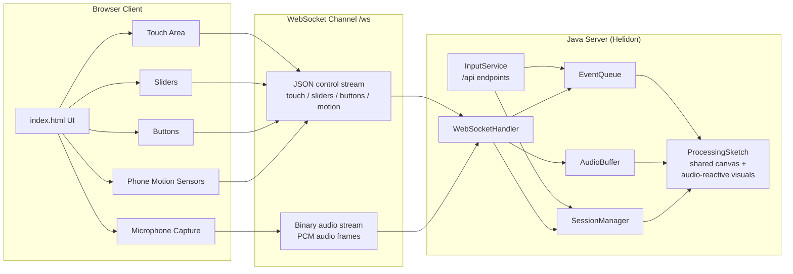
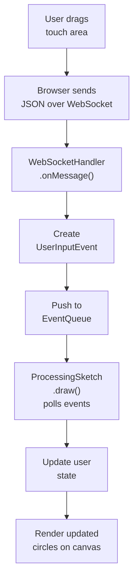
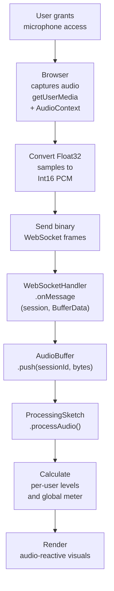
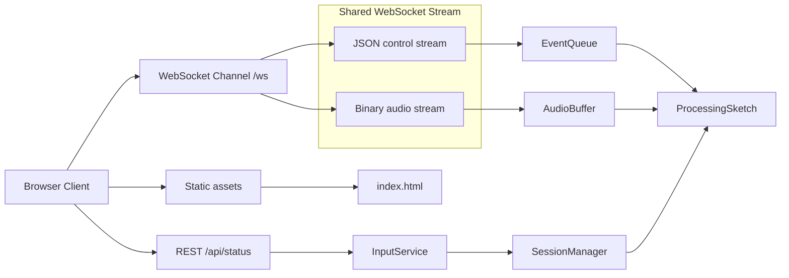
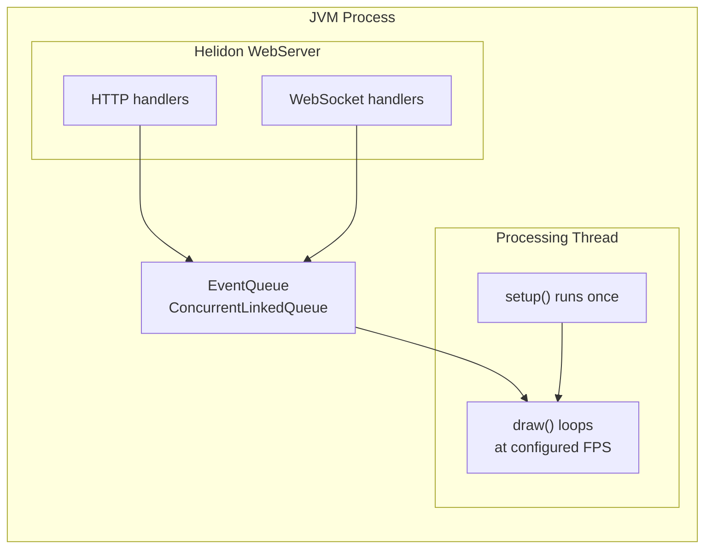

# Processing Server Architecture

## Overview

This application is a multi-user web controller for a Processing sketch running on the server machine. Browser clients connect to a Helidon application, interact with touch areas, sliders, and buttons, optionally stream microphone audio, and the server combines those inputs into one shared Processing canvas.

## Table of Contents

- [Overview](#overview)
- [Architecture Diagram](#architecture-diagram)
- [Data Flow](#data-flow)
- [Configuration](#configuration)
- [Components](#components)
- [Data Flow Summary](#data-flow-summary)
- [Threading Model](#threading-model)
- [How to Extend](#how-to-extend)
- [HTTPS/TLS Configuration](#httpstls-configuration)
- [Running the Application](#running-the-application)
- [File Structure](#file-structure)

## Architecture Diagram

This diagram shows the major runtime components and their structural relationships.



Key details:
- The browser UI is served from `index.html` and exposes touch input, sliders, buttons, microphone capture, and optional phone motion sensors.
- The browser uses one `/ws` connection, but that channel carries two logical streams in parallel: JSON control messages and binary audio frames.
- `WebSocketHandler` separates those streams and forwards them to the correct server-side structures.
- `ProcessingSketch` consumes the shared session, event, and audio state and renders the combined visual result.

---

## Data Flow

This section shows the detailed runtime path for control input and microphone audio.

Contents:
- [Touch/Slider/Button Events (JSON)](#touchsliderbutton-events-json)
- [Motion Events (JSON)](#motion-events-json)
- [Audio Stream (Binary)](#audio-stream-binary)



Key details:
- Touch, slider, button, and motion interactions are normalized in the browser before transmission.
- JSON payloads identify the event type, control ID, normalized value or sensor fields, and timestamp.
- `WebSocketHandler.onMessage()` parses the payload and creates a `UserInputEvent`.
- `ProcessingSketch.draw()` drains the queue once per frame and updates visual state before rendering.

### Touch/Slider/Button Events (JSON)

The browser normalizes touch or mouse coordinates to the `0.0` to `1.0` range, packages them with the control ID and timestamp, and sends them as JSON over the shared WebSocket. On the server side, `WebSocketHandler` parses that message into a `UserInputEvent` and pushes it into `EventQueue`, where it waits for the next `draw()` frame.

### Motion Events (JSON)

Phone motion data uses the same JSON channel. The browser keeps orientation and acceleration samples separately, then sends a combined `motion` event on a fixed interval. On the server side, `WebSocketHandler` clamps those values according to the motion config and pushes the event into `EventQueue`. In `ProcessingSketch`, `handleMotionEvent()` stores the per-session motion state, applies tilt as an offset around the touch target, and converts shake intensity into a burst-like pulse.

### Audio Stream (Binary)



Key details:
- Browser microphone access depends on user permission and usually requires HTTPS for non-local access.
- Audio samples are converted from browser float samples to 16-bit PCM before being sent as binary frames.
- `AudioBuffer` stores queued audio per session so the sketch can process each participant independently.
- The sketch computes per-user levels plus a global meter and uses them to drive the reactive visuals.

---

## Configuration

Contents:
- [Base Config: `src/main/resources/application.yaml`](#base-config-srcmainresourcesapplicationyaml)
- [HTTPS Overlay: `config/application-https.yaml`](#https-overlay-configapplication-httpsyaml)

### Base Config: `src/main/resources/application.yaml`

The base configuration is the local-development profile. It serves the browser UI over HTTP on `127.0.0.1:8080` and does not expose HTTPS unless an overlay is supplied at runtime.

```yaml
server:
  port: 8080
  host: "127.0.0.1"
  features:
    static-content:
      classpath:
        - context: "/"
          location: "/static"
          welcome: "index.html"

processing:
  sketch-class: "com.processing.server.ProcessingSketch"
  width: 800
  height: 600
  fps: 60

audio:
  mode: "high-quality-stereo"
  buffer-size: 2048
  max-buffer-chunks: 20

motion:
  update-hz: 20
  clamp:
    beta-degrees: 60
    gamma-degrees: 60
    acceleration-g: 3.0
    magnitude-g: 4.0
  mapping:
    tilt-offset-normalized: 0.12
    shake-threshold-g: 0.6
    shake-burst-scale: 1.8

debug:
  logging: false
```

| Setting | Purpose |
|---------|---------|
| `server.port` | Local HTTP and WebSocket port |
| `server.host` | `127.0.0.1` keeps the default listener local-only |
| `static-content.classpath` | Serves `src/main/resources/static/` at `/` |
| `processing.sketch-class` | Selects which Processing `PApplet` class the server starts |
| `processing.width/height` | Canvas dimensions |
| `processing.fps` | Target frame rate |
| `audio.mode` | Selects the sample rate/channel profile used by the audio pipeline |
| `audio.buffer-size` | Sets the PCM chunk size used in the audio path |
| `audio.max-buffer-chunks` | Caps queued audio per session so stale audio cannot grow unbounded |
| `motion.update-hz` | Fixed send rate for combined browser motion samples |
| `motion.clamp.*` | Bounds the accepted tilt and acceleration ranges |
| `motion.mapping.*` | Controls how tilt and shake affect the sketch visuals |
| `debug.logging` | Enables extra server-side logging for diagnostics |

### HTTPS Overlay: `config/application-https.yaml`

HTTPS is enabled with a runtime overlay passed as `-Dapp.config=config/application-https.yaml`. The overlay only contributes the optional TLS socket and related keystore settings.

```yaml
server:
  sockets:
    tls:
      port: 8443
      host: "0.0.0.0"
      tls:
        private-key:
          keystore:
            passphrase: "changeit"
            type: "PKCS12"
            resource:
              path: "keystore.p12"
        private-key-cert-chain:
          keystore:
            passphrase: "changeit"
            type: "PKCS12"
            resource:
              path: "keystore.p12"
```

This keeps local HTTP simple while allowing the same packaged jar to expose HTTPS for LAN and mobile clients when needed.

---

## Components

Contents:
- [1. Main.java - Application Entry Point](#1-mainjava---application-entry-point)
- [2. SessionManager.java - Browser Session Registry](#2-sessionmanagerjava---browser-session-registry)
- [3. EventQueue.java - Thread-Safe Event Buffer](#3-eventqueuejava---thread-safe-event-buffer)
- [4. AudioBuffer.java - Per-Session Audio Queue](#4-audiobufferjava---per-session-audio-queue)
- [5. WebSocketHandler.java - Real-Time Input Channel](#5-websockethandlerjava---real-time-input-channel)
- [6. InputService.java - REST API Endpoints](#6-inputservicejava---rest-api-endpoints)
- [7. ProcessingSketch.java - Visual Output and Interaction Model](#7-processingsketchjava---visual-output-and-interaction-model)
- [8. index.html - Browser Client](#8-indexhtml---browser-client)

### 1. Main.java - Application Entry Point

Responsibilities:
- Loads the base config and optional `app.config` overlay.
- Constructs shared services such as `SessionManager`, `EventQueue`, and `AudioBuffer`.
- Starts the Processing sketch and then starts Helidon.
- Wires static content, REST routes, WebSocket routes, and the optional TLS socket.

Runtime orchestration details:
- The sketch starts before the server begins accepting traffic so the Processing window is ready when clients connect.
- The same process serves the browser assets, REST inspection endpoints, and the `/ws` real-time channel.
- Control events and audio frames share one WebSocket route, but they diverge into separate buffers after parsing.

### 2. SessionManager.java - Browser Session Registry

Responsibilities:
- Creates and tracks session IDs for connected browser clients.
- Stores per-session metadata needed by the server and sketch.
- Removes session state when sockets close or error out.

Why it matters:
- The sketch needs stable session IDs so each client keeps its own position, color, and audio state.
- Audio buffers and queued events are keyed by session, so disconnect cleanup must stay consistent.

### 3. EventQueue.java - Thread-Safe Event Buffer

Responsibilities:
- Accepts `UserInputEvent` objects from concurrent network handlers.
- Buffers those events until the Processing animation thread consumes them.
- Preserves a clean producer/consumer boundary between Helidon threads and the sketch thread.

Why it matters:
- It is the thread-safe handoff point between concurrent network handlers and the single Processing render loop.
- It allows frequent touch, slider, and button updates without directly mutating sketch-owned state from outside `draw()`.

### 4. AudioBuffer.java - Per-Session Audio Queue

Responsibilities:
- Stores binary PCM chunks per session.
- Limits buffered audio so stale audio does not accumulate indefinitely.
- Gives the sketch a way to poll and process microphone data independently for each client.

Why it matters:
- Control events are discrete and low bandwidth, while audio is continuous and much higher volume.
- Keeping audio separate from the control-event queue makes buffering and cleanup simpler.

### 5. WebSocketHandler.java - Real-Time Input Channel

Responsibilities:
- Owns the `/ws` connection lifecycle.
- Creates or associates the session for each connection.
- Routes JSON control and motion messages to `EventQueue`.
- Routes binary audio frames to `AudioBuffer`.
- Broadcasts shutdown notices and cleans up sessions on close or error.

Transport model:
- Each browser uses one persistent `/ws` connection.
- Text frames carry JSON control messages for touch, sliders, buttons, motion samples, and client-side state updates.
- Binary frames carry raw PCM audio captured from the browser microphone path.
- The handler keeps session cleanup and disconnect behavior in one place so the sketch does not have to reason about socket lifecycle directly.

### 6. InputService.java - REST API Endpoints

Responsibilities:
- Exposes inspection endpoints such as `/api/status`.
- Provides a simpler HTTP entry point for diagnostics and automation.
- Reports queue, session, and audio-buffer state without requiring a WebSocket client.

Relationship to WebSocket input:
- REST is not the main real-time control path for the browser UI.
- The browser uses WebSocket for low-latency control and microphone streaming.
- `/api/status` is mainly useful for debugging whether sessions, queued events, or audio streams are reaching the server.

### 7. ProcessingSketch.java - Visual Output and Interaction Model

Responsibilities:
- Owns the Processing window and render loop.
- Drains queued input events inside `draw()`.
- Polls per-session audio data and computes visual audio levels.
- Maintains the user state maps used to render circles, colors, animation, and audio-reactive rings.

Audio pipeline details:
- Incoming PCM is converted into per-user levels on the server side rather than streamed back to the browser.
- The audio gain slider changes how strongly the incoming PCM contributes to those visual levels.
- The sketch also maintains a global meter derived from the aggregate activity across connected users.

Event semantics:
- Touch and drag events update target positions rather than snapping immediately to the current draw position.
- The speed slider controls how quickly circles move toward those targets and how fast temporary effects decay.
- Buttons trigger short-lived visual behaviors such as burst, spin color, and scatter.
- Motion events are handled in `handleMotionEvent()`, where tilt is stored as per-session motion state and shake intensity is converted into a pulse boost.

Visual model details:
- Each session owns a core circle plus an outer audio-reactive ring.
- The size slider changes the core circle size, and the outer ring scales proportionally from that base.
- Tilt is applied as a bounded offset around the touch target, so motion layers on top of the existing spatial interaction model.
- Shake uses both acceleration magnitude change and axis-to-axis acceleration change to drive a stronger burst effect.
- All sketch-owned state is mutated on the Processing animation thread so drawing stays deterministic.

### 8. index.html - Browser Client

Responsibilities:
- Renders the control UI and status text.
- Opens the shared WebSocket connection and reconnects when needed.
- Captures pointer, slider, button, microphone, and motion input.
- Displays disconnect or shutdown banners when the server goes away.

Connection details:
- The browser uses HTTP for page delivery and a matching `ws://` or `wss://` WebSocket for real-time input.
- Shutdown or disconnect banners scroll the page to the top so users can see the message even if they were interacting lower on the page.
- The page distinguishes a clean server shutdown notice from an unexpected disconnect.

Control event details:
- Touch and mouse positions are normalized before transmission so the sketch stays resolution-independent.
- Slider values are sent as numeric updates keyed by control ID.
- Button events are discrete JSON messages rather than long-lived state.
- Motion uses browser orientation and acceleration events, combined on a fixed timer before being sent as a single `motion` message.
- The browser-side `Motion Trim` slider scales the outgoing motion sample before transmission, so sensitivity can be adjusted per device without changing server config.

#### Audio Capture

```javascript
const stream = await navigator.mediaDevices.getUserMedia({ audio: true });
```

Audio capture details:
- Browser audio capture depends on user permission and, for non-local access, HTTPS.
- The client converts floating-point browser samples into 16-bit PCM frames before sending them over the WebSocket.
- The browser audio meter is local feedback only; the sketch reacts to the server-processed audio stream.

---

## Data Flow Summary

This diagram shows how control events, audio frames, and REST requests move through the system at runtime.



Key details:
- Static assets load over ordinary HTTP or HTTPS before the browser opens the WebSocket.
- REST stays separate from the shared `/ws` channel and is mainly used for status and debugging.
- JSON control events and binary audio travel in parallel over the same socket connection but are handled by different server-side queues.
- The sketch consumes both streams during its frame loop and renders the combined result in one shared Processing window.

---

## Threading Model



Key details:
- Helidon request handling is concurrent and hands work off to thread-safe shared structures.
- `EventQueue` is the handoff point between network-facing handlers and the single Processing animation thread.
- `setup()` runs once and `draw()` loops continuously.
- Sketch-owned visual state is only mutated on the Processing animation thread.

**Thread safety:**
- `EventQueue` uses `ConcurrentLinkedQueue` for concurrent push/poll.
- `SessionManager` uses `ConcurrentHashMap` for session storage.
- `ProcessingSketch` owns the mutable visual state maps and updates them only inside the Processing thread.

---

## How to Extend

Contents:
- [Add a New Event Type](#add-a-new-event-type)
- [Add a New REST Endpoint](#add-a-new-rest-endpoint)
- [Stream Video Back to Clients](#stream-video-back-to-clients)

### Add a New Event Type

1. Frontend in `index.html`:

```javascript
document.getElementById('newControl').addEventListener('input', (e) => {
    sendEvent('newType', 'newControlId', e.target.value / 100);
});
```

2. Backend in `ProcessingSketch.java`:

```java
case "newType" -> {
    // Handle your new event type
}
```

The general rule is:
- browser UI emits a JSON control message
- `WebSocketHandler` parses it into a `UserInputEvent`
- `ProcessingSketch` applies it inside `draw()`

### Add a New REST Endpoint

In `InputService.java`:

```java
@Override
public void routing(HttpRules rules) {
    rules
        .post("/event", this::handleEvent)
        .get("/newEndpoint", this::newHandler);
}

private void newHandler(ServerRequest req, ServerResponse res) {
    res.send("response");
}
```

Use REST for status, diagnostics, or tooling-oriented calls. Use WebSocket for low-latency interaction.

### Stream Video Back to Clients

That would require:
1. Capturing Processing canvas frames.
2. Encoding them to an image or video format.
3. Delivering them over WebSocket, WebRTC, or an HTTP streaming endpoint.

That is intentionally outside the current architecture, which only sends control input from the browser to the sketch.

---

## HTTPS/TLS Configuration

Contents:
- [Why HTTPS?](#why-https)
- [Keystore Structure](#keystore-structure)
- [Creating the Keystore](#creating-the-keystore)
- [TLS Configuration in Code](#tls-configuration-in-code)
- [Testing TLS](#testing-tls)
- [Browser Certificate Warning](#browser-certificate-warning)
- [Changing the IP Address](#changing-the-ip-address)
- [Changing the Password](#changing-the-password)

The server uses HTTPS to enable secure WebSocket connections (`wss://`), which are required for browser microphone access from mobile devices and remote clients.

### Why HTTPS?

Browsers require secure contexts for:
- `getUserMedia()` microphone access
- secure WebSocket connections (`wss://`)
- reliable cross-device access from phones and tablets

Local same-machine testing can stay on plain HTTP at `http://localhost:8080/`.

### Keystore Structure

The server uses a PKCS12 keystore, `keystore.p12`, at the project root. It contains:
- a self-signed CA certificate
- a server certificate signed by that CA
- SAN entries for `localhost`, `127.0.0.1`, the current LAN IP, and `hostname.local`

The certificate chain matters. A plain self-signed leaf certificate without the CA chain is not enough for the intended Helidon TLS setup.

### Creating the Keystore

Use the project scripts instead of manually running `keytool` commands:

```powershell
.\create-keystore.ps1
.\create-keystore.ps1 192.168.1.100
.\create-keystore.ps1 -Force
```

```bash
./create-keystore.sh
./create-keystore.sh 192.168.1.100
./create-keystore.sh --force
```

The scripts generate the CA and server certificate chain, write `keystore.p12` at the project root, and export `processing-server-ca.cer` alongside it.

### TLS Configuration in Code

The server reads socket configuration from Helidon config. The base config enables local HTTP, and the optional overlay contributes the `server.sockets.tls` subtree.

Key points:
- local HTTP remains on `127.0.0.1:8080`
- optional LAN/mobile HTTPS lives in `config/application-https.yaml`
- HTTPS is enabled at runtime with `-Dapp.config=config/application-https.yaml`
- the `/ws` endpoint is attached on both the default HTTP listener and the optional `tls` listener
- the keystore is external to the jar, so regenerating it does not require a rebuild

### Testing TLS

You can verify the TLS setup with OpenSSL:

```powershell
.\run-https.ps1
openssl s_client -connect localhost:8443 -showcerts
```

You should see the server certificate followed by the local CA certificate in the reported chain.

### Browser Certificate Warning

Browsers will warn until the exported CA certificate is trusted on the client device. For local development that is expected.

Typical flow:
1. Generate the keystore.
2. Trust `processing-server-ca.cer` on the test device.
3. Visit `https://YOUR_IP:8443/` or `https://YOUR_HOSTNAME.local:8443/`.

### Changing the IP Address

If the machine moves to a different network, the LAN IP in the SAN may no longer match. In that case:
1. regenerate the keystore with the new IP
2. restart with `.\run-https.ps1` or `./run-https.sh`

Using `hostname.local` can reduce how often clients need to use the raw IP address, but it still depends on local name resolution support.

### Changing the Password

If you change the keystore password, update:
- the keystore generation scripts
- the keystore settings in `config/application-https.yaml`

---

## Running the Application

Contents:
- [Prerequisites](#prerequisites)
- [Build](#build)
- [Run](#run)
- [Packaging Tradeoff](#packaging-tradeoff)
- [Access](#access)

### Prerequisites

- Java 21 minimum, Java 25+ recommended
- Maven 3.9+

### Build

```powershell
$env:JAVA_HOME = "C:\Program Files\Java\jdk-25"
mvn clean package -DskipTests
```

### Run

Local HTTP:

```powershell
.\run.ps1
```

Optional HTTPS:

```powershell
.\create-keystore.ps1 192.168.1.100
.\run-https.ps1
```

Manual launch is also supported:

```powershell
java -jar .\target\processing-server-1.0-SNAPSHOT.jar
java -Dapp.config=config/application-https.yaml -jar .\target\processing-server-1.0-SNAPSHOT.jar
```

### Packaging Tradeoff

This project intentionally builds an executable shaded jar instead of using the thinner Helidon example layout used by `processing-client`.

- `processing-client` stays closer to the stock example structure, where runtime dependencies are managed as a separate layout.
- `processing-server` builds a single runnable jar so users can launch it with `java -jar`.
- The downside is a larger artifact and the usual shade-plugin warnings about overlapping resources and metadata.
- The upside is a much simpler launch flow for a desktop-style runnable application.

For this project, the simpler launch flow is the more important tradeoff.

### Access

- Local UI: `http://localhost:8080/`
- Local API: `http://localhost:8080/api/status`
- LAN/mobile UI: `https://YOUR_HOSTNAME.local:8443/` or `https://YOUR_IP:8443/`
- WebSocket: `ws://localhost:8080/ws` locally, `wss://YOUR_HOSTNAME.local:8443/ws` or `wss://YOUR_IP:8443/ws` over HTTPS

Notes:
- local development uses HTTP by default
- the optional HTTPS socket uses a self-signed local CA
- mobile devices typically require HTTPS for microphone access

---

## File Structure

The TLS keystore lives at the project root, and HTTPS is enabled through `config/application-https.yaml` plus `-Dapp.config=...` at launch time.

```text
processing-server/
|-- pom.xml                           # Maven build configuration
|-- README.md                         # Getting started guide
|-- ARCHITECTURE.md                   # This file
|-- CUSTOMIZATION.md                  # Customization guide
|-- TODO.md                           # Follow-up tasks and ideas
|-- CHANGELOG.md                      # Project change history
|-- run.ps1                           # PowerShell run script
|-- run.sh                            # Bash run script
|-- run-https.ps1                     # PowerShell HTTPS launch script
|-- run-https.sh                      # Bash HTTPS launch script
|-- create-keystore.ps1               # Windows keystore generator
|-- create-keystore.sh                # Bash keystore generator
|-- keystore.p12                      # Generated TLS keystore
|-- processing-server-ca.cer          # Exported CA certificate
|-- config/
|   `-- application-https.yaml        # HTTPS overlay config for -Dapp.config
|-- src/
|   `-- main/
|       |-- java/com/processing/server/
|       |   |-- Main.java             # Entry point, config loading, route setup
|       |   |-- ProcessingSketch.java # Processing canvas and visual behavior
|       |   |-- WebSocketHandler.java # WebSocket lifecycle and control/audio ingress
|       |   |-- InputService.java     # REST API handlers
|       |   |-- SessionManager.java   # User session tracking
|       |   |-- EventQueue.java       # Thread-safe event queue
|       |   |-- AudioBuffer.java      # Per-session audio queue
|       |   |-- AudioConfig.java      # Audio configuration record
|       |   |-- DebugConfig.java      # Debug logging flag
|       |   `-- UserInputEvent.java   # Event data record
|       `-- resources/
|           |-- application.yaml      # Base local HTTP config
|           `-- static/
|               `-- index.html        # Browser UI
`-- target/                           # Build output created after the first Maven build
```
