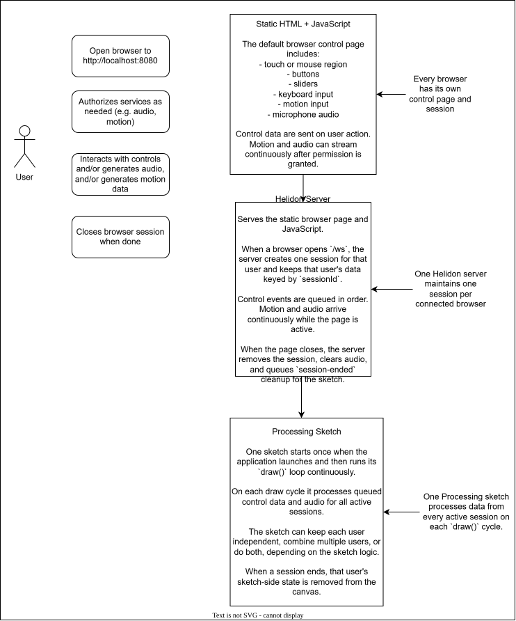

# Top-Level Session Flow

This diagram is rendered from the Draw.io source at [../top-level flow.drawio](../top-level%20flow.drawio).

The `.drawio` file is the primary editable source. The SVG below is the markdown-friendly rendered artifact.

