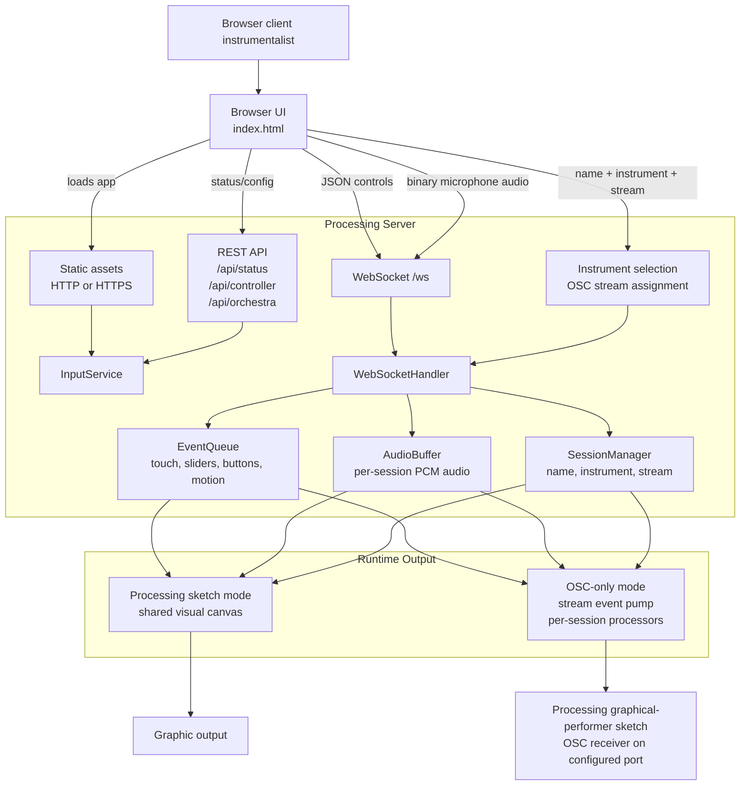

# Top-Level Session Flow

This diagram is the markdown-friendly version of the Draw.io source at [../top-level flow.drawio](../top-level%20flow.drawio).

The `.drawio` file remains the primary editable source. This Mermaid version is used here because VS Code's Markdown preview can fail to render Draw.io SVG exports that contain embedded HTML labels.

The older SVG export is still available at [assets/top-level-flow.svg](assets/top-level-flow.svg) when a renderer supports it.
